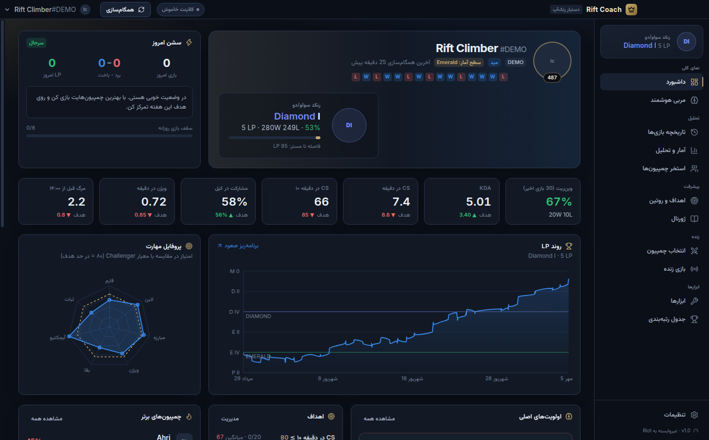
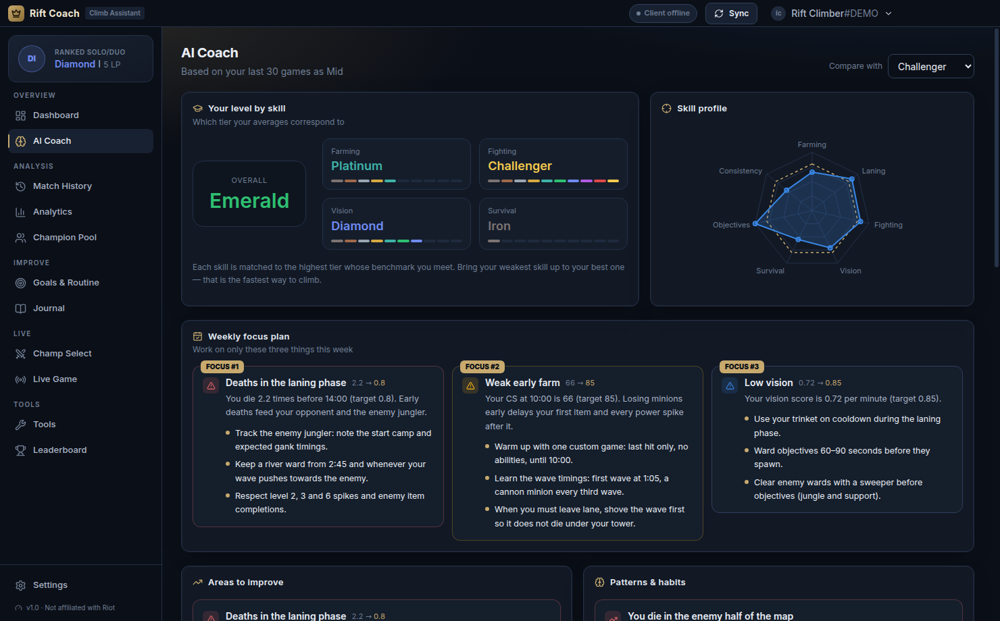
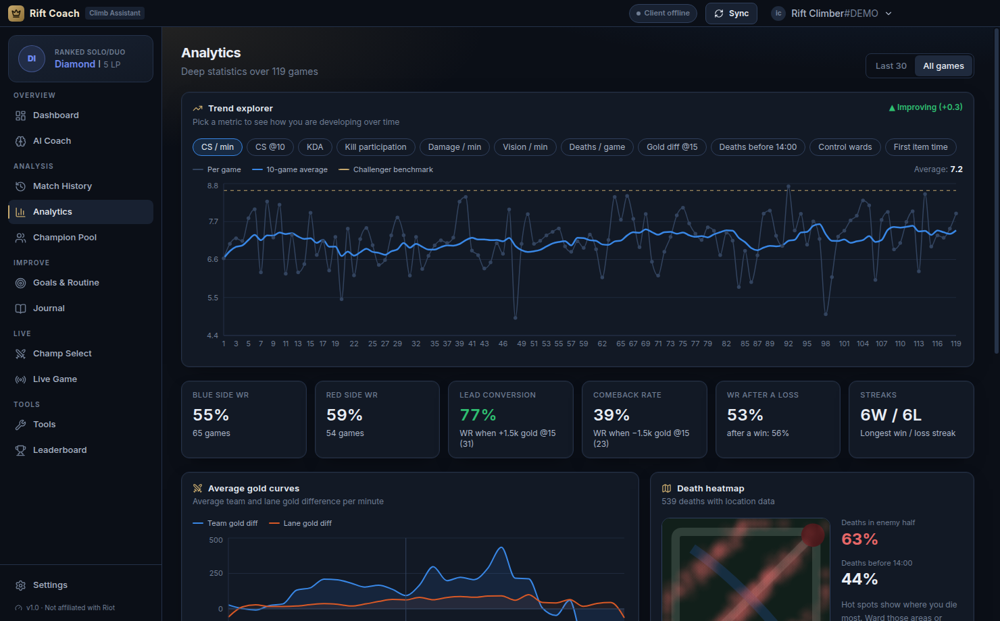
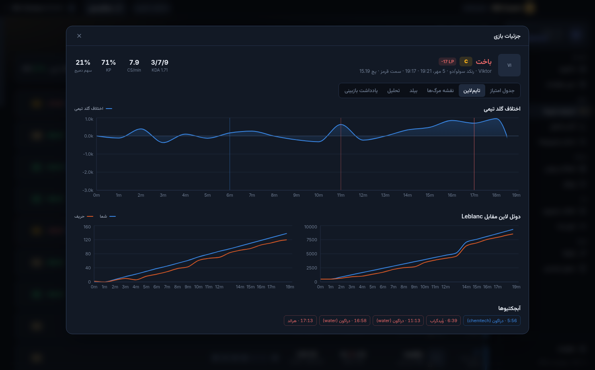
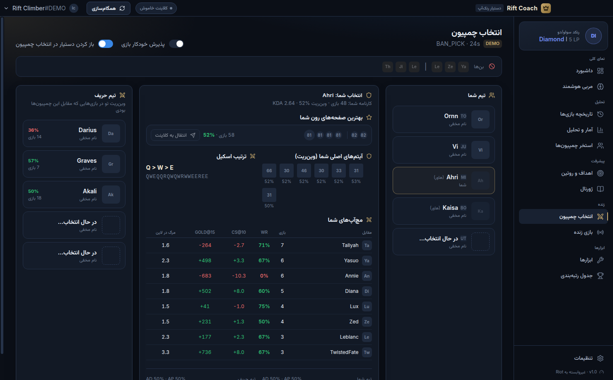

<div dir="rtl">

# 👑 Rift Coach — دستیار رنک‌آپ League of Legends

یک برنامه دسکتاپ ویندوز برای تحلیل حرفه‌ای بازی‌ها و مربی‌گری شخصی، ساخته شده برای یک هدف: **رسیدن به چلنجر**.

همه داده‌ها روی کامپیوتر خودت ذخیره می‌شوند. برنامه فقط از **API رسمی Riot** و **API محلی کلاینت لیگ** استفاده می‌کند (هیچ خواندن حافظه یا تزریقی به بازی وجود ندارد).



## ✨ امکانات

### تحلیل
- **داشبورد**: رنک و LP، فرم اخیر، شاخص‌های کلیدی در مقایسه با معیار رنک هدف، نمودار روند LP، پروفایل مهارت (رادار)، سشن امروز و هشدار تیلت
- **تاریخچه بازی‌ها** با فیلتر صف/نتیجه/رول/چمپیون، تغییر LP هر بازی و **نمره هر بازی (S+ تا D)**
- **جزئیات هر بازی**: جدول امتیاز کامل ۱۰ نفر، نمودار اختلاف گلد تیمی، دوئل لاین (گلد و CS در برابر حریف)، آبجکتیوها، **نقشه مرگ‌ها و کیل‌ها**، ترتیب خرید آیتم با زمان، رون‌ها، ترتیب اسکیل، و تحلیل شاخص به شاخص
- **آمار و تحلیل**: روند پیشرفت هر شاخص (میانگین متحرک + خط معیار)، منحنی میانگین گلد، **نقشه حرارتی مرگ‌ها**، تبدیل برتری/کامبک، وین‌ریت بعد از باخت، وین‌ریت بر اساس ساعت/روز/طول بازی/شماره بازی در سشن، سمت آبی/قرمز
- **استخر چمپیون‌ها**: آمار هر چمپیون، استخر پیشنهادی (Main / Secondary / Pocket)، چمپیون‌هایی که باید کنار بگذاری، **بهترین صفحه‌های رون شخصی** (انتقال به کلاینت با یک کلیک)، آیتم‌های اصلی، ترتیب اسکیل، مچ‌آپ‌ها و توانایی‌ها/کول‌داون‌ها

### مربی هوشمند
- مقایسه همه شاخص‌ها با **معیارهای چلنجر** (یا هر رنک دیگری) بر اساس رول تو
- تخمین «سطح واقعی» تو در هر مهارت (فارم، مبارزه، ویژن، بقا)
- **برنامه تمرکز هفتگی** با سه اولویت اصلی و تمرین‌های مشخص
- تشخیص الگوها: مرگ در نیمه حریف، تبدیل نکردن برتری، ضعف در بازی‌های طولانی، استخر چمپیون بزرگ، تیلت بعد از باخت، افت در سشن‌های طولانی، بهترین ساعت‌های بازی، افت فارم بعد از لاین
- اصول صعود (عادت‌های بازیکنان چلنجر)

### پیشرفت
- **اهداف قابل اندازه‌گیری** (مثلاً CS@10 ≥ 80) که بعد از هر بازی خودکار پیگیری می‌شوند + پیشنهاد هدف از طرف مربی
- **روتین روزانه** با استریک و تقویم ۳۵ روزه
- **ژورنال** بازبینی بازی‌ها: برچسب اشتباه‌ها/کارهای خوب، وضعیت ذهنی، صف بازبینی هوشمند (اول باخت‌ها) و آمار اشتباه‌های تکراری
- **تیلت‌گارد**: هشدار بعد از باخت‌های پیاپی و سقف بازی روزانه (با اعلان ویندوز)

### زنده
- **دستیار انتخاب چمپیون** (خودکار باز می‌شود): بن‌ها، پیک‌ها، کارنامه تو با چمپیون انتخابی، بهترین رون‌هایت (انتقال به کلاینت)، وین‌ریت تو مقابل چمپیون‌های حریف، تحلیل ترکیب تیم (AD/AP، فرانت‌لاین و…)
- **پذیرش خودکار بازی** (Auto-accept) با تأخیر قابل تنظیم
- **بازی زنده**: ریتم CS نسبت به هدف، تایمر خودکار دراگون/الدر/بارون/اینهیبیتور از رویدادهای بازی، وضعیت هر دو تیم
- **اسکات بازی**: رنک، وین‌ریت، مستری و برچسب‌هایی مثل One-trick / Hot streak برای هر ۱۰ بازیکن
- **اورلی داخل بازی** (همیشه رو، شفاف و غیرقابل کلیک): تایمرها و ریتم CS
- همگام‌سازی خودکار بعد از هر بازی + اعلان خلاصه بازی

### ابزارها
- **برنامه‌ریز صعود**: چند بازی تا چلنجر؟ (با LP واقعی هر برد/باخت از تاریخچه‌ات و کات‌آف واقعی چلنجر)
- تایمر دستی آبجکتیوها و بوف‌ها با هشدار صوتی، کول‌داون سامونر اسپل‌ها
- مرجع چمپیون‌ها با توانایی‌ها و کول‌داون‌ها
- **جدول رتبه‌بندی** چلنجر/گرندمستر منطقه تو و فاصله دقیقت تا کات‌آف

### سایر
- رابط کاربری **فارسی (راست‌به‌چپ)** و انگلیسی
- چند اکانت (اسمورف/اصلی)
- پشتیبان‌گیری و بازیابی، پروکسی اختیاری، اجرا در System Tray
- **حالت نمایشی (Demo)** برای امتحان همه امکانات بدون کلید API

## 📥 دانلود و نصب

1. به تب **Actions** همین ریپازیتوری برو، آخرین اجرای موفق «Build Windows app» را باز کن و از بخش **Artifacts** فایل `Rift-Coach-Windows` را دانلود کن.
   (اگر یک تگ مثل `v1.0.0` بسازی، فایل‌ها در بخش **Releases** هم قرار می‌گیرند.)
2. داخل آن دو فایل هست:
   - `Rift-Coach-Setup-x.y.z.exe` — نصب‌کننده
   - `Rift-Coach-Portable-x.y.z.exe` — نسخه پرتابل بدون نصب
3. چون برنامه امضای دیجیتال ندارد، ویندوز ممکن است پیام SmartScreen نشان دهد: روی **More info** و بعد **Run anyway** بزن.

## 🔑 راه‌اندازی

در اولین اجرا سه انتخاب داری:

| روش | توضیح |
|---|---|
| **کلید Riot API** (پیشنهادی) | بهترین کیفیت داده، تایم‌لاین کامل، لدر و اسکات هر بازیکن |
| **کلاینت لیگ** | بدون نیاز به کلید؛ تاریخچه را مستقیم از کلاینت باز روی همین کامپیوتر می‌خواند |
| **حالت نمایشی** | داده ساختگی برای آشنایی با برنامه |

**گرفتن کلید Riot API:**
1. به [developer.riotgames.com](https://developer.riotgames.com/) برو و با اکانت Riot وارد شو.
2. در صفحه Dashboard روی **Regenerate API Key** بزن و کلید `RGAPI-...` را کپی کن.
3. در برنامه کلید را ذخیره کن، Riot ID خودت (مثلاً `Name#TAG`) و منطقه (EUW، ME، TR و…) را وارد کن.

> ⚠️ کلید **Development** هر ۲۴ ساعت منقضی می‌شود. برای استفاده طولانی‌مدت از همان سایت یک **Personal API Key** درخواست بده (منقضی نمی‌شود)، یا منبع داده را روی «کلاینت لیگ» بگذار.

**نکات:**
- برای دیدن اورلی، بازی را در حالت **Borderless** یا **Windowed** اجرا کن.
- اگر از ایران وصل می‌شوی و دسترسی به سرورهای Riot محدود است، در تنظیمات می‌توانی **پروکسی** (مثلاً `http://127.0.0.1:10809`) وارد کنی؛ در غیر این صورت تنظیمات پروکسی ویندوز استفاده می‌شود.
- اولین همگام‌سازی با کلید Development به دلیل محدودیت درخواست Riot (۱۰۰ درخواست در ۲ دقیقه) ممکن است چند دقیقه طول بکشد؛ بعد از آن فقط بازی‌های جدید دریافت می‌شوند.

## 🛠 ساخت از سورس

نیازمندی: Node.js 22

```bash
npm install
npm run dev        # اجرای حالت توسعه
npm test           # تست‌ها
npm run typecheck  # بررسی تایپ‌ها
npm run dist       # ساخت نصب‌کننده ویندوز (روی ویندوز اجرا شود) → پوشه release/
```

## 🧱 ساختار پروژه

```
src/
  main/        فرایند اصلی Electron: ذخیره‌سازی، Riot API (با Rate limiter)، اتصال به کلاینت (LCU)، بازی زنده، اورلی
  preload/     پل امن بین UI و فرایند اصلی
  shared/      انواع داده، نرمال‌سازی بازی‌ها (match-v5 و کلاینت)، داده نمایشی، منطق تایمرها
  renderer/    رابط کاربری React + Tailwind
    lib/       موتور تحلیل، معیارها، مربی هوشمند
    pages/     صفحه‌ها
tests/         تست‌های Vitest
```

## ⚖️ قوانین و حریم خصوصی

- کلید API به‌صورت رمزنگاری‌شده (Windows DPAPI) روی همان کامپیوتر ذخیره می‌شود و هرگز جایی ارسال نمی‌شود جز سرورهای Riot.
- این برنامه برای استفاده شخصی ساخته شده است. اتصال به کلاینت لیگ (LCU) رسمی پشتیبانی نمی‌شود ولی ابزارهای مشابه زیادی از آن استفاده می‌کنند؛ امکاناتی مثل Auto-accept را با مسئولیت خودت استفاده کن.
- معیارهای «چلنجر» تقریبی هستند و برای جهت‌دهی تمرین استفاده می‌شوند، نه به‌عنوان عدد دقیق.

</div>

---

## English

**Rift Coach** is a Windows desktop app (Electron + React + TypeScript) that analyses your League of Legends games and coaches you towards Challenger.

- **Dashboard** – rank & LP graph, recent form, KPIs vs. target-tier benchmarks, skill radar, today's session and tilt status
- **Match history & game detail** – full scoreboard, team gold graph, lane duel, objectives, death/kill map, build order, runes, skill order, per-game grade and metric analysis
- **Analytics** – trend explorer, gold curves, death heatmap, lead conversion & comeback rate, winrate by hour/weekday/length/session game
- **Champion pool** – per-champion stats, recommended pool, what to drop, your best rune pages (one-click import into the client), core items, skill order, matchups, abilities
- **AI coach** – benchmarks per role, tier estimate per skill, weekly focus plan with drills, pattern detection (overextending, throws, tilt, fatigue, best hours…)
- **Goals, daily routine, journal and tilt guard**
- **Champ select assistant**, **auto-accept**, **live game** panel with automatic objective timers, **game scouting** and an **in-game overlay**
- **Climb planner**, manual timers, champion reference and the **Challenger/GM ladder** with live cutoffs
- Persian (RTL) and English UI, multiple accounts, backup/restore, proxy support and a full **demo mode**

Data comes from the official **Riot API** (development or personal key) or straight from the **League client** running on the same PC (no key needed). Everything is stored locally.

Build: `npm install` → `npm run dev` / `npm test` / `npm run dist` (Windows). The GitHub Actions workflow builds the installer and a portable exe on every push (see the run's artifacts) and attaches them to a GitHub release for `v*` tags.

| | |
|---|---|
|  |  |
|  |  |

<sub>Screenshots were taken in demo mode on a machine without access to Riot's image CDN, so champion and item icons show placeholders.</sub>

<sub>Rift Coach isn't endorsed by Riot Games and doesn't reflect the views or opinions of Riot Games or anyone officially involved in producing or managing Riot Games properties. Riot Games, and all associated properties are trademarks or registered trademarks of Riot Games, Inc.</sub>
